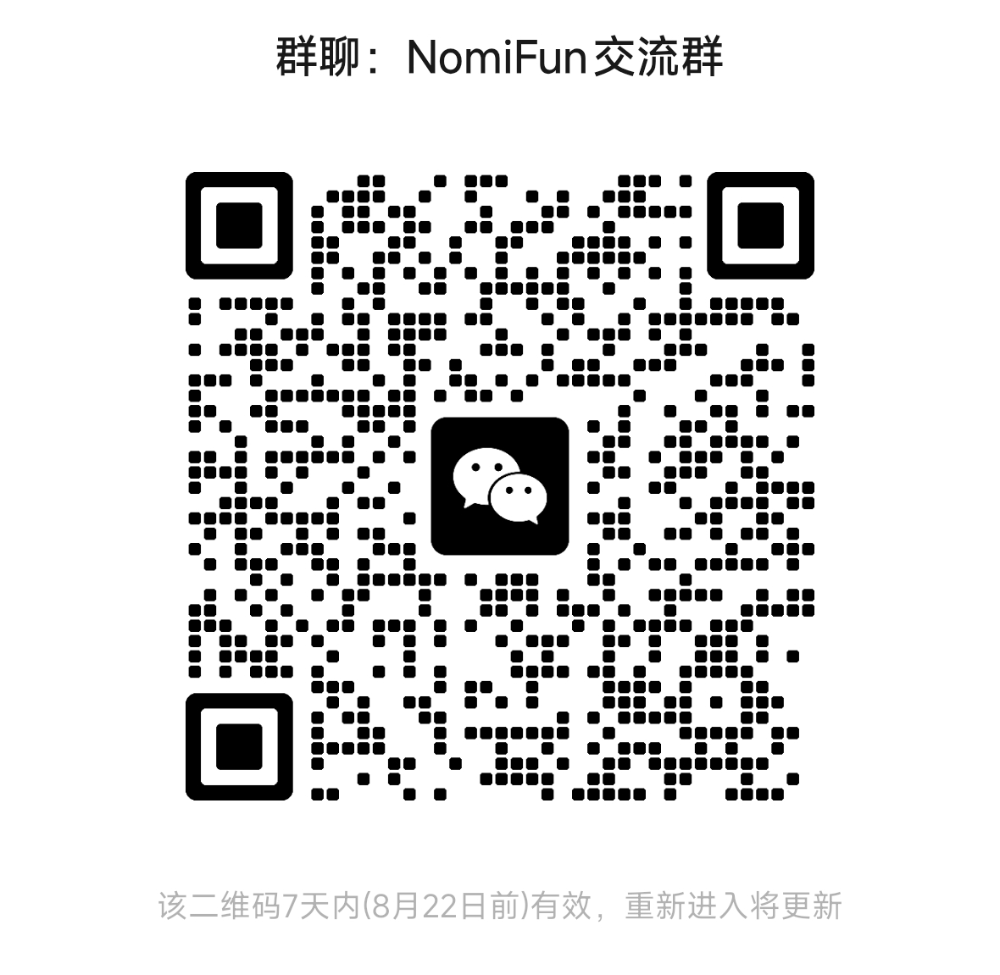

# nomifun-mobile

NomiFun 的手机端（Android / iOS / H5），基于 **Expo (React Native)**。

手机是“随身入口”：所有引擎执行、24h 持续工作都由 **NomiFun Desktop** 承担，
手机通过桌面端 WebUI 的 HTTP/WS API，与桌面状态完全互通，并增强移动场景
能力（扫码连接、完成通知）。桌面端既可以被手机局域网直连，也可以通过
`nomifun-net-infra` 的 Relay 业务隧道承载。

## NomiFun 开源产品家族

NomiFun 由三个互相关联的开源项目组成。**Desktop 是本地 AI 与数据中枢，Mobile
是随身客户端，小智云台是机器人载体。** 你可以按场景选择 Mobile 或小智云台，
但它们都通过 Desktop 获得统一的模型、Agent、伙伴、任务和本地数据能力。

| 项目 | 定位 | 了解与参与 |
|---|---|---|
| [NomiFun Desktop](https://github.com/nomifun/nomifun-desktop) | Windows / macOS / Linux 本地 AI 工作站，负责模型、Agent、Skills、知识、任务、数据和开放接口；是 Mobile 与小智云台的能力中枢 | [产品介绍](https://www.nomifun.com/zh/products/desktop/) · [源码](https://github.com/nomifun/nomifun-desktop) · [WebUI / Mobile 接入](https://github.com/nomifun/nomifun-desktop/blob/main/docs/guides/webui-remote-access.zh.md) |
| **[NomiFun Mobile](https://github.com/nomifun/nomifun-mobile)**（本仓库） | Android / iOS / H5 随身客户端，通过 HTTP / WebSocket 使用 Desktop 的会话、任务、需求、伙伴与模型能力 | [产品介绍](https://www.nomifun.com/zh/products/mobile/) · [源码](https://github.com/nomifun/nomifun-mobile) · [连接与认证协议](https://github.com/nomifun/nomifun-mobile/blob/main/docs/research/connectivity.md) |
| [NomiFun 小智云台](https://github.com/nomifun/nomifun-xiaozhi-yuntai) | ESP32-S3 小智机器人与云台工程，连接 Desktop 的伙伴能力，面向语音、动作和实体交互 | [产品介绍与演示](https://www.nomifun.com/zh/products/xiaozhi-yuntai/) · [源码](https://github.com/nomifun/nomifun-xiaozhi-yuntai) · [接入 Desktop](https://github.com/nomifun/nomifun-desktop/blob/main/docs/guides/xiaozhi-robot.zh.md) |

产品总览与三个项目的入口也可以从 [NomiFun 官网](https://www.nomifun.com/zh/products/) 获取。

### 推荐接入顺序

1. 安装并运行 [NomiFun Desktop](https://github.com/nomifun/nomifun-desktop)，
   在 **远程&开放能力 → WebUI 访问** 中开启服务。
2. Mobile 打开“连接桌面端”，扫描 Desktop 面板生成的一次性二维码；也可以手输
   `IP:端口` 与面板中的账号密码。详细边界见
   [Desktop WebUI 远程访问文档](https://github.com/nomifun/nomifun-desktop/blob/main/docs/guides/webui-remote-access.zh.md)。
3. 需要实体机器人时，再构建小智云台固件，并按
   [Desktop 小智接入文档](https://github.com/nomifun/nomifun-desktop/blob/main/docs/guides/xiaozhi-robot.zh.md)
   将设备绑定到指定伙伴。

> Mobile 不复制 Desktop 的数据与执行引擎。断开 Desktop 后，依赖服务端的功能也
> 会停止；暴露局域网或公网入口前，请先阅读 Desktop 的认证与网络安全说明。

## 功能

| 模块 | 说明 |
|---|---|
| 会话 | 会话列表、聊天详情、流式回复、发送/停止、重命名/置顶/删除 |
| 定时任务 | 任务列表、启停、立即运行、运行历史、创建 |
| 需求平台 | 需求列表（按状态筛选）、详情、状态流转、创建、关联会话跳转 |
| 桌面伙伴 | 伙伴花名册、状态、身份/人设编辑 |
| 模型管理 | 供应商与模型、连通性、默认模型 |
| 客服 | 客服员工配置、笔记、访客对话监控 |
| 通知 | 会话回复完成 / 定时任务完成 / 需求完成的本地通知（H5 为浏览器通知） |

## 架构

### Desktop 中枢 + Mobile 轻客户端

NomiFun 没有把 Desktop 简单包装成一个依赖厂商云端的手机网页，而是把职责拆分为：

- **Desktop 是唯一的本地中枢**：持有本地数据、模型配置、Agent / 伙伴、Skills、
  知识库、会话和自动化任务，并持续执行需要长时间运行的工作。
- **Mobile 是轻量交互端**：不复制执行引擎和完整业务数据，通过 Desktop 已开放的
  同一套 WebUI API 查看实时状态、发送指令并接收完成通知。
- **控制与实时事件分离**：业务查询和命令走 HTTP `/api/*`；流式回复、任务状态等
  增量事件复用一个 WebSocket `/ws`，减少轮询和重复实现。
- **连接路径由用户控制**：可信局域网内可直接访问 Desktop；跨网可使用自部署的
  `nomifun-net-infra` Relay、VPN/Tailscale 或带 TLS 的安全反向代理。Mobile 只访问
  Desktop API 或 Relay 业务入口，不接触 Relay 管理员 API。

这种架构让同一个 Desktop 中枢可以同时服务桌面 UI、Mobile 和机器人载体：核心能力
与数据规则只有一份，客户端只负责适合各自设备的交互，因此跨端状态一致，也不会在
每个终端重复维护一套 Agent 引擎。

```
┌──────────────┐   HTTP /api/* + WS /ws   ┌──────────────────┐   QUIC   ┌──────────────┐
│ NomiFun Mobile│ ◄──────────────────────► │ Relay 业务入口   │ ◄──────► │ nfagent      │
│ (Expo RN/H5) │       Bearer JWT          └──────────────────┘          └──────┬───────┘
└──────┬───────┘                                                                  │
       │ 也可局域网直连                                                             ▼
       └──────────────────────────────────────────────────────────────► NomiFun Desktop
```

- Desktop 默认只有本机回环监听器；只有用户主动开启“WebUI 远程访问”时，才按需创建
  LAN 监听器，因此不开启就不会向局域网暴露入口。
- 连接方式一（推荐）：App 扫描 Desktop 面板生成的二维码
  （`http://<ip>:25808/qr-login?token=…`）。二维码 token 仅短时有效且只能消费一次，
  成功认证后再换取有期限的 JWT；二维码只能由 Desktop 本机生成。
- 连接方式一也接受未来 Desktop 生成的 `nomi://pair?v=1&url=…` 配对包；
  它只包裹现有的 Desktop QR 登录 URL，Mobile 仍通过 `/api/auth/qr-login`
  兑换 JWT，不会接触 Relay 管理员密码或 enrol token。
- 连接方式二：手输桌面端或 Relay **业务入口**地址 + 用户名密码（密码显示在
  桌面端面板上）。Relay 控制台端口不是 Mobile 的连接地址。
- 远程 HTTP 请求使用 Bearer JWT 与 CSRF 双提交保护，WebSocket 也需要认证；认证凭据
  应像登录密码一样妥善保存，设备丢失或网络环境变化时应在 Desktop 侧撤销或重置。
- H5 形态必须与服务端**同源**部署/代理（浏览器跨域 Cookie 限制），开发期由
  `scripts/dev-proxy.mjs` 合并到同一端口；原生 App 无此限制，直接绝对地址访问。
- 当前 LAN 入口和未终止 TLS 的 raw Relay 隧道都是 HTTP 明文通信，只适用于可信网络
  或临时联调；跨网生产部署必须配置 HTTPS/WSS、VPN/Tailscale 或等价安全边界。
- “无 NomiFun 云端中转”不等于“所有能力完全离线”：Desktop 是否访问第三方云模型
  取决于用户选择的模型供应商，Mobile 也必须能够连接到正在运行的 Desktop。
- 进一步阅读：[Mobile 连接、认证与安全边界](https://github.com/nomifun/nomifun-mobile/blob/main/docs/research/connectivity.md)、
  [HTTP + WebSocket 实时协议](https://github.com/nomifun/nomifun-mobile/blob/main/docs/research/ws-protocol.md)、
  [Desktop WebUI 远程访问](https://github.com/nomifun/nomifun-desktop/blob/main/docs/guides/webui-remote-access.zh.md)、
  [Relay 集成](docs/RELAY-INTEGRATION.md) 与 [配对 URL 契约](docs/PAIRING-URL.md)。

## 开发（Ubuntu，H5 优先）

先起一个 nomifun 服务端（二选一）：

```bash
# A. 无头服务器（开发推荐，桌面仓库内）：
cd ~/src/nomifun-tauri
NOMIFUN_DATA_DIR=/tmp/nomifun-dev cargo run -p nomifun-web -- --port 8787 --api-only \
  --admin-password 'dev-Password1'

# B. 或运行 Nomifun 桌面端，并打开「WebUI 远程访问」（端口 25808），
#    然后 NOMIFUN_SERVER=http://127.0.0.1:25808 指向它。
```

再启动移动端 H5：

```bash
bun install
bun run dev        # = Expo web (8081) + 开发代理 (8788，绑 0.0.0.0)
```

浏览器/手机访问 `http://<本机IP>:8788`，用密码登录即可。
环境变量：`NOMIFUN_SERVER`（默认 `http://127.0.0.1:8787`）、`PORT`（默认 8788）。

Relay 的初始化、agent 入网、业务隧道创建、端口边界和本地验收见
[`docs/RELAY-INTEGRATION.md`](docs/RELAY-INTEGRATION.md)。注意：
Mobile 只使用 Relay 的业务入口端口，不持有 Relay 管理员凭据。
如果要按当前三项目自动配对流程从头复测，请直接照着
[`docs/PUBLIC-RELAY-TEST.md`](docs/PUBLIC-RELAY-TEST.md) 操作。

> ⚠️ 登录接口有限流：**15 分钟内 5 次失败**即锁定，调试时别反复试错密码。

## 真机 / 打包

iOS、Android 的权限与网络配置已就绪（相机扫码、通知、明文 HTTP 局域网访问、
iOS 本地网络描述），无需再改原生配置：

```bash
bun run android          # 本地调试（需 Android SDK / 模拟器或真机）
bun run ios              # 需 macOS
bun x eas build -p android --profile preview   # 云端打 APK
bun x eas build -p ios --profile preview       # 云端打 iOS（需 Apple 账号）
bun run export:web       # 导出 H5 静态产物 (dist/)，部署时与服务端同源反代
```

## 目录

```
src/api/          HTTP 客户端(Bearer+CSRF)、连接存储、WS 客户端、认证流程
src/app/          expo-router 路由（connect / scan 登录前；(app)/ 登录后）
src/components/ui 通用 UI 组件（主题化）
src/constants/    设计 token（色板与桌面端主题契约对齐）
src/features/     各功能域（api + hooks + 组件）
src/i18n/         中文优先的多语言资源
scripts/dev-proxy.mjs  H5 同源开发代理
docs/research/    桌面端 API/协议调研笔记（实现依据）
docs/FOUNDATION.md 基础设施契约
```

## 一期边界

- Mobile 已兼容任意 HTTP(S) 桌面端或 Relay 业务入口地址；Relay 的实际部署、
  agent 注册和隧道生命周期由运维侧负责。
- 当前没有把 Relay 管理员 API 暴露给 Mobile，也没有把部署、provisioning、
  NAT/ACME/公网可达性包装成「一键连接」。loopback 联调通过不代表公网验收通过。
- pairing URL 目前只是 Mobile 侧的解析/兑换兼容层；Desktop/Relay 尚未被本轮
  修改，现有 Desktop QR URL 仍是首选输入格式。
- 渠道机器人创建、知识库管理、MCP/技能、终端等重交互留在桌面端。

## 联系与交流

- 官网与产品文档：[https://www.nomifun.com](https://www.nomifun.com)
- 问题反馈：[nomifun-mobile Issues](https://github.com/nomifun/nomifun-mobile/issues)
- 联系邮箱：[535526063@qq.com](mailto:535526063@qq.com)
- 微信交流群：请使用微信扫描下方二维码。二维码可能会按群有效期更新，请以仓库最新
  图片为准。


